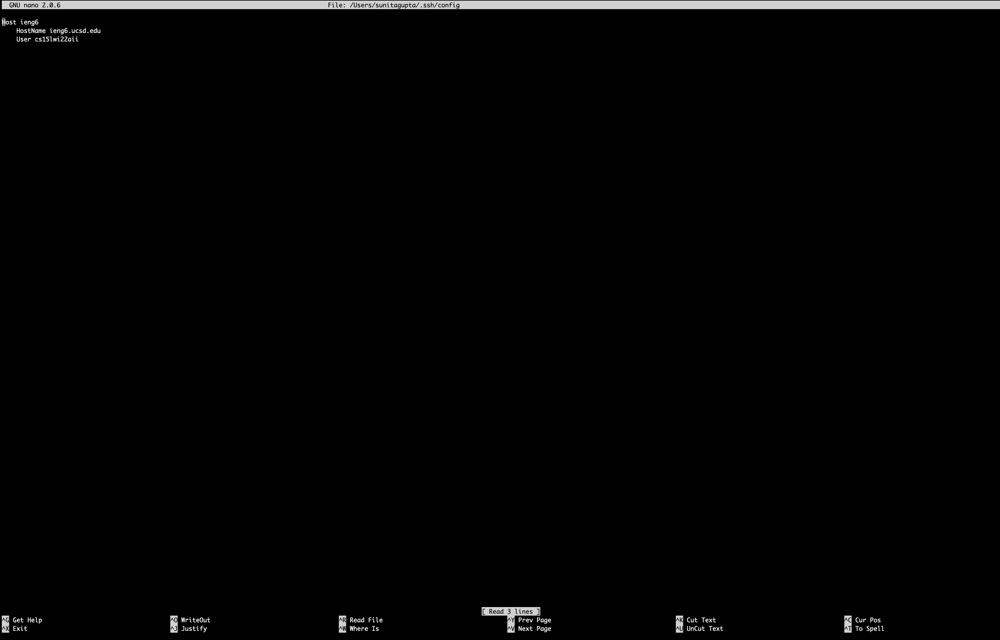
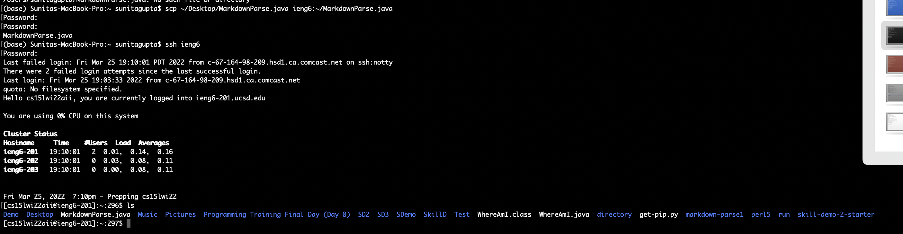

# Lab Report 3 

[Main Page](https://shreyagupta112.github.io/cse15l-lab-reports/)

## Streamline SSH Configuration

I used the command `nano ~/.ssh/config` to create the file shown above.

---

I successfully logged in to my ieng6 account using the `ssh ieng6` command on the terminal and typing my passphrase key

---

I used `scp` to copy the file `MarkdownParse.java` into my ieng6 account.  The exact command I used was `scp ~/Desktop/MarkdownParse.java ieng6:~/MarkdownParse.java`.
