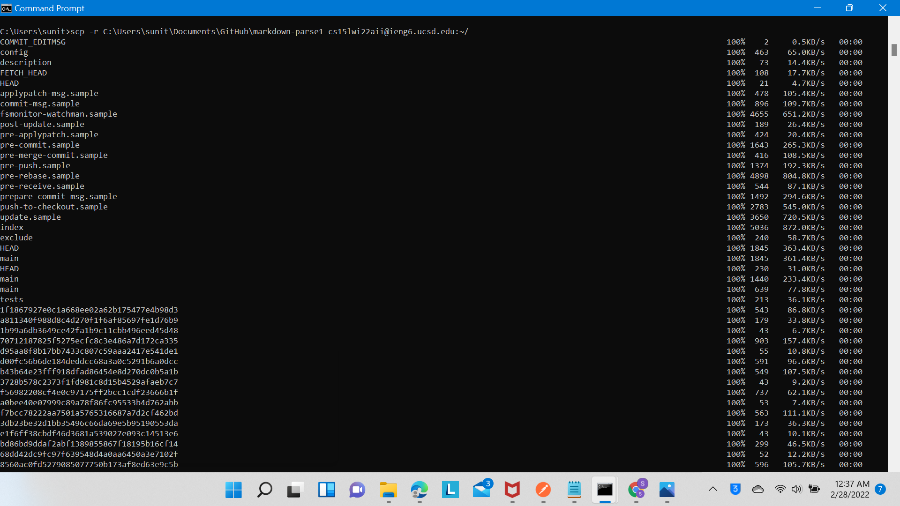
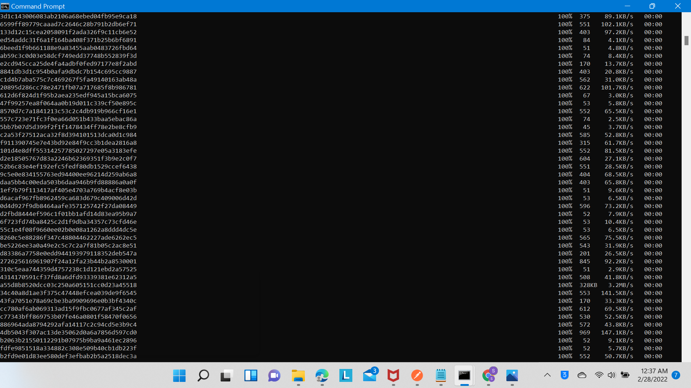
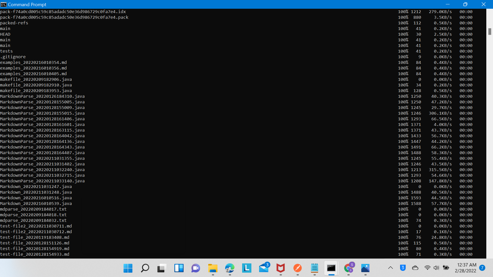
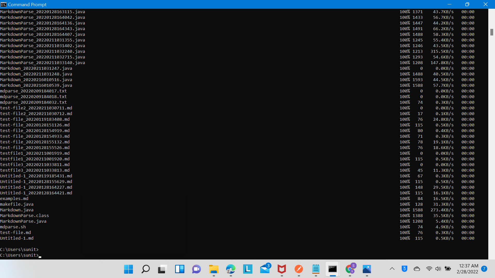
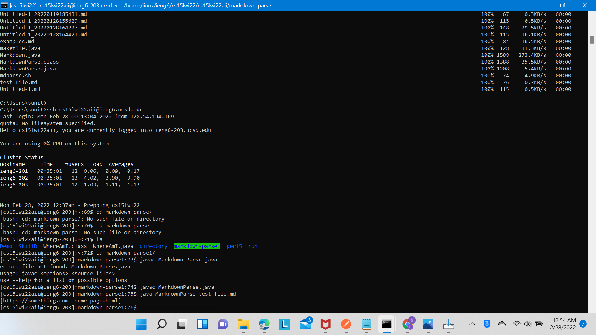
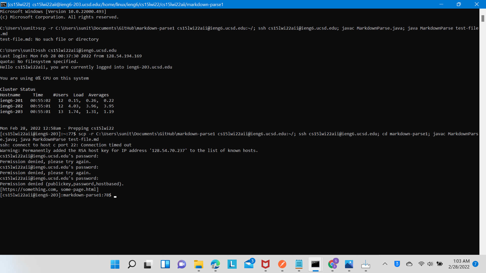

# Lab 3: Copy whole directories with scp -r
# 1. Copying whole markdown-parse directory to ieng6 account






Commands I ran: 
```
scp -r C:\Users\sunit\Documents\GitHub\markdown-parse1 cs15lwi22aii@ieng6.ucsd.edu:~/
```
This copied the markdown-parse directory into my ieng6 account.  The `-r` part of the `scp -r` command made it run recursively whih copied every file in the directory over.
---
# 2. Logged into ieng6 account and ran tests


Commands I ran:
```
ssh cs15lwi22aii@ieng6.ucsd.edu
cd markdown-parse1
javac MarkdownParse.java
java MarkdownParse test-file.md
```
The first command logged into my ieng6 account, teh second entered the markdown-parse1 directory (in which all teh code and tests were), and the last two commands ran the tests.
---
# 3. Combined `scp`, `;`, and `ssh` commands to run tests


Commands I ran:
```
scp -r C:\Users\sunit\Documents\GitHub\markdown-parse1 cs15lwi22aii@ieng6.ucsd.edu:~/; ssh cs15lwi22aii@ieng6.ucsd.edu; cd markdown-parse1; javac MarkdownParse.java; java MarkdownParse test-file.md
```
This last assignemnt used all the commands in the above two assingmenets to acheive the same thing, but in one big command by tying everything together using `;`.

